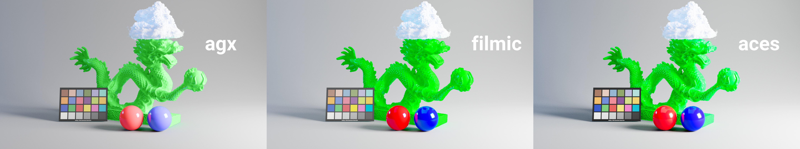
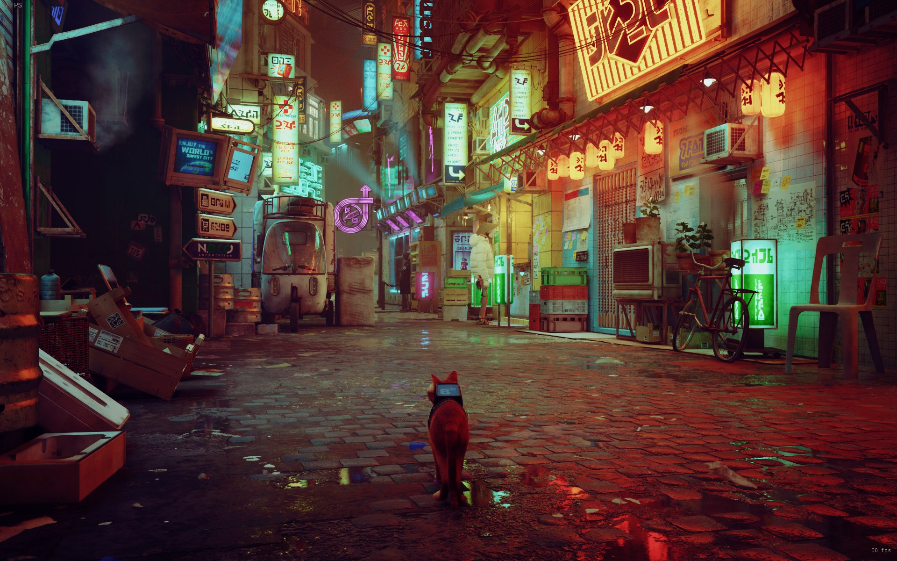

"Fork" of Troy Sobotka's AgX https://github.com/sobotka/AgX with implementation si various languages/softwares.

> extreme example rendered with pure ACEScg primaries

# Integrations

- OpenColorIO : v1 compatible
- ReShade : for in-game use.
- OBS : to apply on live camera feed
- Python : with numpy as only dependency

### ReShade

### OBS

