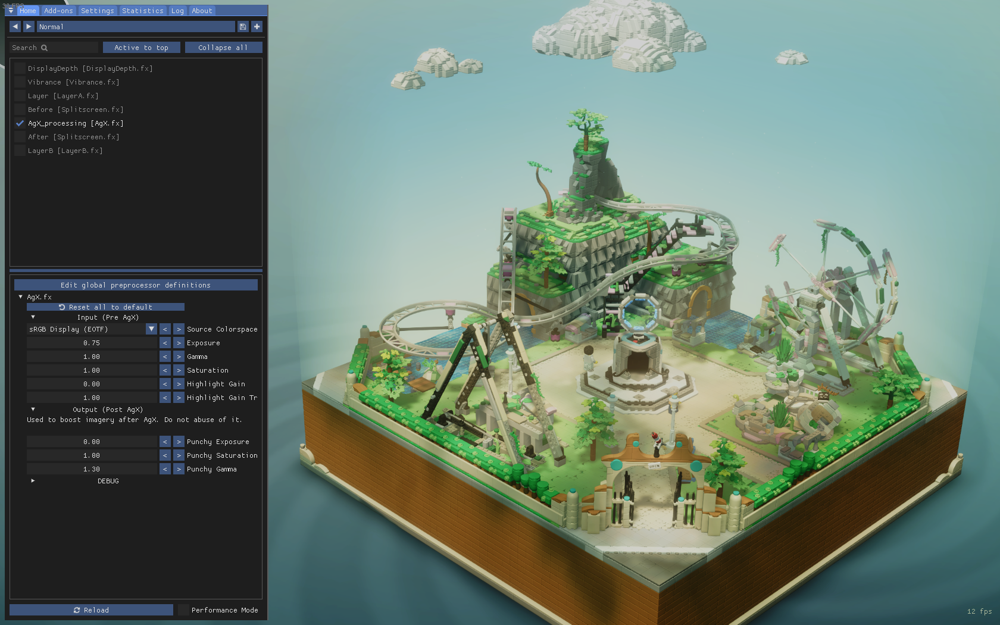
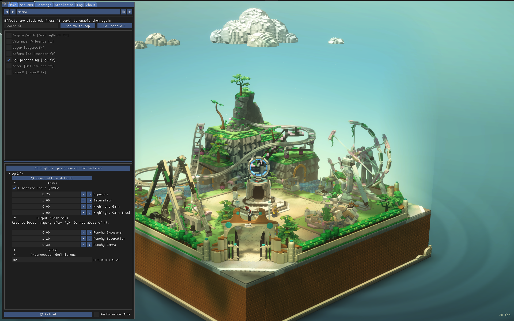

# AgX.hlsl

AgX implementation for ReShade. *(ReShade is a generic post-processing injector for games and video software)*

# Install

- Install ReShade for your desired game as usual.
- Add the content of the [reshade-shaders/](reshade-shaders/) directory in the `reshade-shaders` directory that you must find next the `game.exe`. (or wherever you specified it should be.)
- In game open ReShader interface and enable `AgX_processing`

# Use

AgX is a DRT (Display Rendering Transform), this means it must comes last in the chain of imagery operations. So always put it at the bottom of your effect stack so it is applied last.

## Input

Options here affect the image before AgX is applied. You can go wild with the values if you like so.

## Output

Options here affect the image after AgX is applied. This means tweaks here might produce the usual clipping / skews / posterization effect so play with the values softly.

For now the Output is SRGB - Display (with 2.2 power function) (and as it always has been for most game)

# Limitations

1. AgX except "open domain" / "scene-referred" / "high dynamic range" data as input. But ReShade input is "closed-domain" / "display-referred" / "low dynamic range". This can be compensate by increasing the Input Exposure and boosting highlights.
2. Even if AgX "improve" color-rendition, it might not still looks better overall. Because the game was designed to look good under a different display-transform and not under AgX. (see [this RDR2 example](img/RDR2-2-AgX.jpg) where the sky looks more flat.)

# Comparisons

Check the [img/](img/) directory to find comparison images in different games.

 

# Contributing

This was my first hlsl/reshade shaders so please feel free to open a Pull-Request if you want to improve anything on the code.
