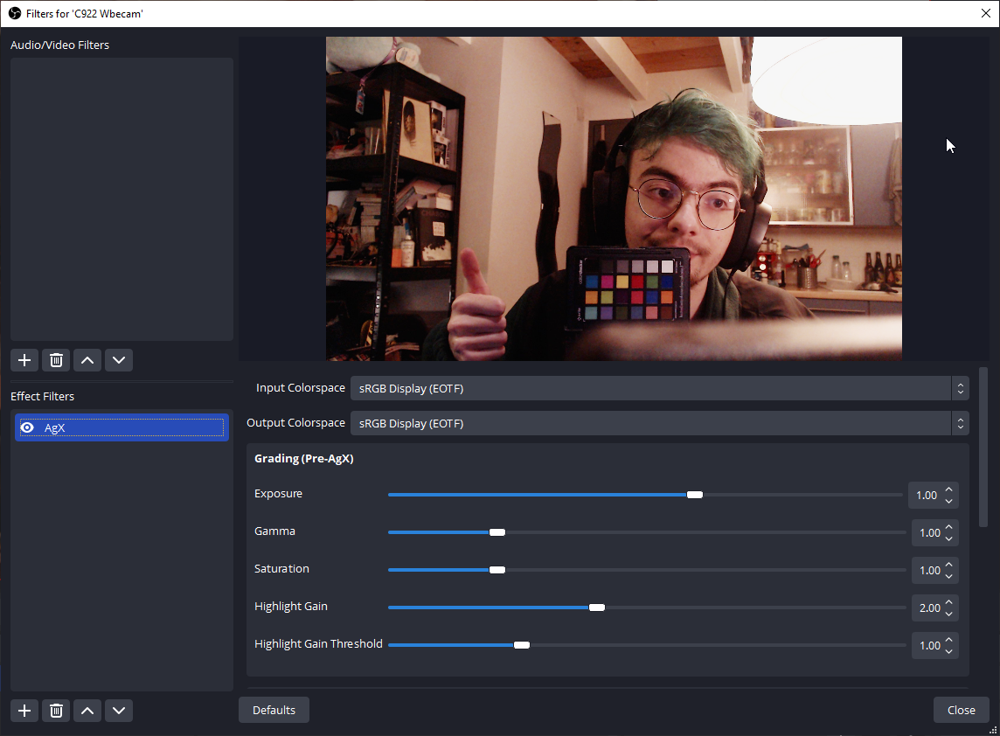
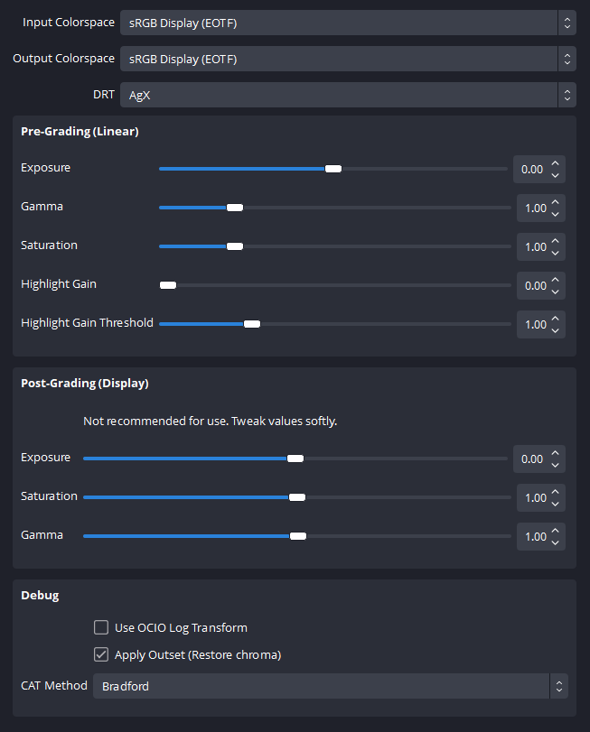

# obs

Implementation of AgX for [OBS](https://obsproject.com/) as a script.

This is mainly intended to be applied on live camera feeds as this would have not much benefit
to apply this on desktop captures.

# Requirements

- This has been developed on OBS 28.1.2 for Windows but should work for lower version
and other operating systems.

- Nothing more than the content of this directory.

# Installation

Put the **whole** content of the [obs-script](obs-script) directory anywhere you want.

1. Open OBS
2. In the top menu > Tools > Scripts
3. Click on the `+` button, and browse to the location of the `obs-script/AgX.lua` file.

The script is now active. A new filter has been created :

1. Go to your Scene/Source where you want to add the AgX filter and select it (the source)
2. Click on the `Filters` button that should be a bit above the source.
3. In the **Effect Filters** section, click the `+` button and choose AgX

All done ! You can now configure it.

# Configuration

> **Note** Reminder that AgX being a display transform it should be put at the
> very end of the image processing chain. (so at the bottom in OBS)

The camera/video-source and your lighting setup will affect how much you need
to tweak the paramaters. There is no setup that work for all cases (but once
you configured for your camera/ usual lighting you will not need to touch it anymore)

## Recommended

I recommend to always start by :

- boosting the Grading Exposure by +1.0 stop.
- boosting `Highligh Gain` by 2.0

## Available

### Input Colorspace

Pick in which colorspace your source is encoded. 

Passthrough means the no decoding is applied.

### Output Colorspace

Target colorspace encoding. Must correspond to your monitor calibration.

### Grading/...

Adjust imagery look in a Linear space, before AgX is applied.

### Grading/Exposure

Exposure in stops. 0.0 = neutral.

### Grading/Gamma

Power function. 1.0 = neutral.

### Grading/Saturation

Saturation based on BT.709 coeff. 1.0 = neutral.

### Grading/Highlight Gain

Only boost the brightest part of the image. The range of those brightests part can be adjusted
via `Highlight Gain Threshold`.

0.0 = neutral.

### Grading/Highlight Gain Threshold

See above.

### Punchy/...

Grading modifications applied after AgX on display encoded data. This will
introduce skews, clipping and other artefact.

Recommended to change small values if used.

### Debug/Use OCIO Log Transform

Switch to use the HLSL transform being an exact match to the OCIO `log2Transform`.

Does not create any change visually.

### Debug/Apply Outset

Not originally included in the first AgX version but should be in the future.
Restore chroma and avoid having to use Punchy saturation.

