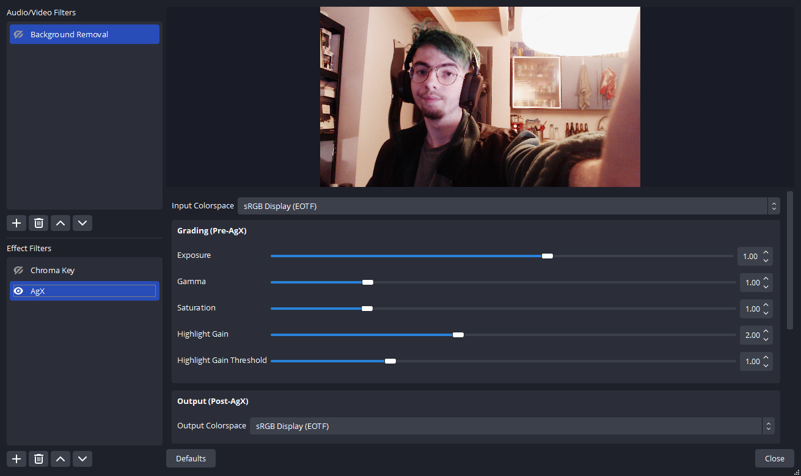

# obs

Implementation of AgX for [OBS](https://obsproject.com/) as a script.

# Requirements

- This has been developed on OBS 28.1.2 for Windows but should work for lower version
and other operating systems.

- Nothing more than the content of this directory.

# Installation

Put the **whole** content of the [obs-script](obs-script) directory anywhere you want.

1. Open OBS
2. In the top menu > Tools > Scripts
3. Click on the `+` button, and browse to the location of the `obs-script/AgX.lua` file.

The script is now active. A new filter has been created :

1. Go to your Scene/Source where you want to add the AgX filter and select it (the source)
2. Click on the `Filters` button that should be a bit above the source.
3. In the **Effect Filters** section, click the `+` button and choose AgX

All done ! You can now configure it :

> **Note** Reminder that AgX being a display transform it should be put at the
> very end of the image processing chain. (so at the bottom in OBS)