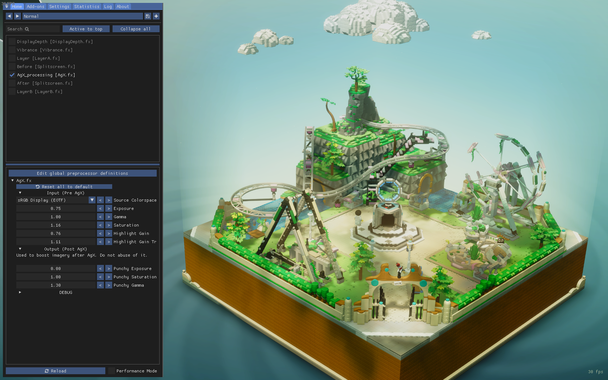
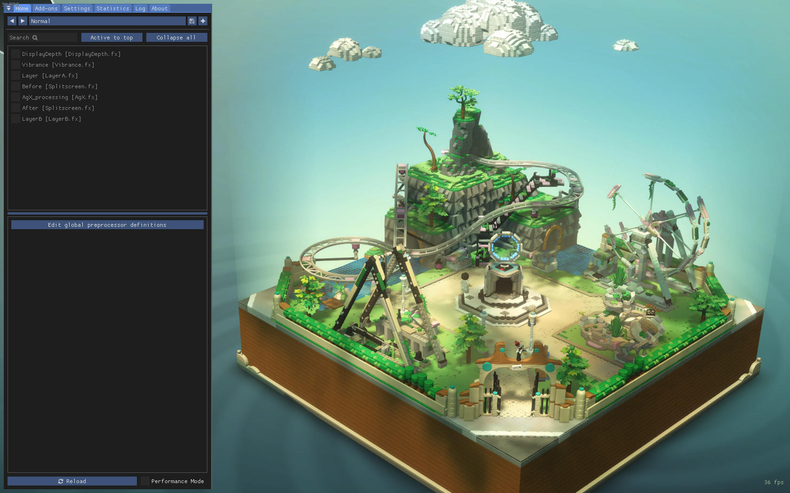

# AgX.hlsl

AgX implementation for ReShade, a generic post-processing injector for games and video software.

# Install

- Install ReShade for your desired game as usual.
- Add the content of the [reshade-shaders/](reshade-shaders/) directory in the `reshade-shaders` directory that you must find next the `game.exe`. (or wherever you specified it should be.)
- In game open ReShader interface and enable `AgX_processing`

# Use

AgX is a Display Rendering Transform (DRT), which means it must come last in the chain of imagery operations, **so always put it at the bottom of your effect stack.**

## Options

### Input

Options here affect the image before AgX is applied. You can go wild with the values if you like so. AgX will produce pleasing results with nice falloff even in extreme configurations. (that will still look extreme of course)

### Output

Options here affect the image after AgX is applied. This means tweaks here might produce the usual clipping / skews / posterization effect so play with the values softly.

For now the output image is encoded as "sRGB - Display" (with a 2.2 power function) as it always has been for most games.

## Workflow

- Once AgX enable, I recommend to always increase the `Highlight Gain` to something around 1.0. This will "compensate" for flat highlights that will be produced.
- AgX being a DRT it not meant to provide a creative look to your image (even if the look it give contribute to the creative direction of the image). Nothing prevent you to apply more creative transforms before AgX. Feel free to put some color corrections before. You can try some LUTs too but be aware that some might try to do the same job as AgX and combining them might result in unpleasing visuals. (ex: don't apply an ACES/reinhard/... and other "tonemappers" before AgX.)
- On some game, the default rendering of AgX might not look that good (as explained in Limitations). For example very colourful stylized games. In that case you can retrieve some chroma by boosting first the saturation in the `Input` section. And then in the `Output` section slightly if the result still looks "dull".

# Limitations

1. AgX expects "open domain" / "scene-referred" / "high dynamic range" data as input. But ReShade input is "closed-domain" / "display-referred" / "low dynamic range". This can be compensated by increasing the Input Exposure and boosting the highlights.

There is no magic here. If you have very clamped, destroyed imagery as the input, it will still look just as bad.

2. Even if AgX "improves" color-rendition, it might still not look better overall, as the game was designed to undergo a different display-transform instead of AgX. (see [this RDR2 example](img/RDR2-2-AgX.jpg) where the sky looks more flat.)

When comparing the before and after with AgX, you might find highlights in the AgX version to look flatter. Rather than doing a quick comparison, just try to let your brain/eyes adapt to it for a few minutes, then disable it and compare.

# Comparisons

Check the [img/](img/) directory to find comparison images from different games.

Here's a bunch of interactive before/after comparisons:

- Stray : https://imgsli.com/MTMxNDMw
- Lego Bricktales : https://imgsli.com/MTMxNDMx

 

# Contributing

This was my first hlsl/reshade shader so please feel free to open a Pull Request if you want to improve anything in the code, especially performance which I totally neglected.
